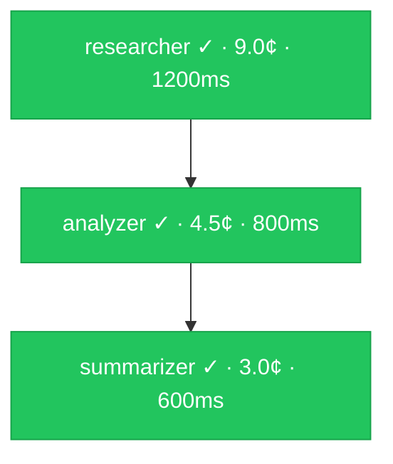
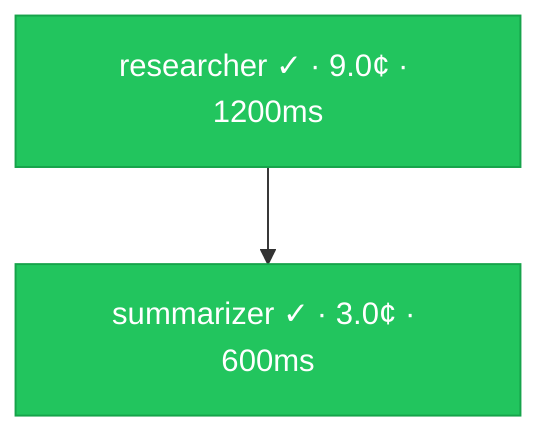

# Visualization

Turn any `ExecutionResult` or `StateMachine` into diagrams. Three output formats:

- **Mermaid** — renders in GitHub issues/PRs/READMEs, Notion, Obsidian, VS Code, GitLab
- **Gantt** — execution timeline from trace spans
- **HTML** — self-contained dashboard with DAG diagram, step table, and cost breakdown

**Source:** `src/viz/`

---

## Table of Contents

1. [Quick Start](#quick-start)
2. [Mermaid Diagrams](#mermaid-diagrams)
3. [Gantt Timeline](#gantt-timeline)
4. [HTML Dashboard](#html-dashboard)
5. [StateMachine.toMermaid()](#statemachinetoMermaid)
6. [Embedding in GitHub](#embedding-in-github)
7. [Config Reference](#config-reference)

---

## Quick Start

```typescript
import {
  executionToMermaid,
  traceToMermaidGantt,
  toHTML,
  exportHTML,
  openInBrowser,
} from 'swarmwire'

const result = await swarm.execute('Research TypeScript best practices')

// Mermaid flowchart — paste into any Mermaid renderer
const diagram = executionToMermaid(result)
console.log(diagram)

// Open a full interactive dashboard in your browser (macOS/Linux/Windows)
await openInBrowser(result, { title: 'Research Pipeline' })

// Write report to a file
await exportHTML(result, './reports/run.html')
```

---

## Mermaid Diagrams

**Source:** `src/viz/mermaid.ts` — `executionToMermaid(result, config?)`

Generates a Mermaid `flowchart TD` diagram from an `ExecutionResult`. Each node shows:
- Agent name and step status icon
- Cost in cents (optional)
- Duration in ms (optional)
- Error snippet for failed steps

Edges reflect step dependencies. Colors reflect status:

| Status | Color |
|--------|-------|
| complete | green `#22c55e` |
| failed | red `#ef4444` |
| running | blue `#3b82f6` |
| skipped | gray `#6b7280` |
| pending | amber `#f59e0b` |

### Example output

```
flowchart TD
    step_1["researcher ✓ · 9.0¢ · 1200ms"]
    step_2["analyzer ✓ · 4.5¢ · 800ms"]
    step_3["summarizer ✓ · 3.0¢ · 600ms"]

    step_1 --> step_2
    step_2 --> step_3

    style step_1 fill:#22c55e,stroke:#16a34a,color:#fff
    style step_2 fill:#22c55e,stroke:#16a34a,color:#fff
    style step_3 fill:#22c55e,stroke:#16a34a,color:#fff
```

Which renders as:



### Usage

```typescript
import { executionToMermaid } from 'swarmwire'

const diagram = executionToMermaid(result, {
  showCost: true,       // default true
  showDuration: true,   // default true
  showTokens: false,    // default false
})

// Write to a markdown file
await fs.writeFile('diagram.md', `\`\`\`mermaid\n${diagram}\n\`\`\``)
```

---

## Gantt Timeline

**Source:** `src/viz/mermaid.ts` — `traceToMermaidGantt(trace, config?)`

Converts an `ExecutionTrace` into a Mermaid Gantt chart. Each step appears as a bar with its duration relative to execution start.

```typescript
import { traceToMermaidGantt } from 'swarmwire'

const gantt = traceToMermaidGantt(result.trace, { title: 'Research Pipeline' })
console.log(gantt)
```

```
gantt
    title Research Pipeline
    dateFormat x
    axisFormat %Lms

    section researcher
    researcher :done, 0, 1200
    section analyzer
    analyzer :done, 1250, 800
    section summarizer
    summarizer :done, 2100, 600
```

Which renders as a horizontal timeline with each step's duration. Failed steps appear in red (`crit`).

---

## HTML Dashboard

**Source:** `src/viz/html.ts`

A full dark-theme dashboard with four sections:
- **Summary cards** — status, total cost, tokens, duration, steps completed
- **Execution DAG** — Mermaid flowchart rendered interactively
- **Steps table** — agent, status badge, cost, duration, error details
- **Cost by agent** — per-agent cost and LLM call count

Requires internet access to load Mermaid.js from CDN. For offline use, bundle Mermaid separately and replace the CDN `<script>` tag.

### Generate HTML string

```typescript
import { toHTML } from 'swarmwire'

const html = toHTML(result, {
  title: 'Code Review Pipeline — 2026-04-10',
  showCost: true,
  showDuration: true,
})

// Use in an Express route
app.get('/report/:id', async (req, res) => {
  const result = await loadResult(req.params.id)
  res.setHeader('Content-Type', 'text/html')
  res.send(toHTML(result, { title: `Report ${req.params.id}` }))
})
```

### Write to file

```typescript
import { exportHTML } from 'swarmwire'

await exportHTML(result, './reports/run-2026-04-10.html', {
  title: 'Daily Research Run',
})
```

### Open in browser (dev workflow)

```typescript
import { openInBrowser } from 'swarmwire'

// Writes a temp file and opens with the system default browser
const tmpPath = await openInBrowser(result, { title: 'Debug run' })
console.log('Opened:', tmpPath)
```

Works on macOS (`open`), Linux (`xdg-open`), and Windows (`start`).

### CI artifact

```typescript
// vitest setup — export a report after each full test run
afterAll(async () => {
  if (lastResult) {
    await exportHTML(lastResult, `./test-reports/swarm-${Date.now()}.html`)
  }
})
```

---

## StateMachine.toMermaid()

`StateMachine` instances expose a `toMermaid()` method alongside the existing `toDot()`.

```typescript
import { StateMachine, buildLinearStateMachine, END } from 'swarmwire'

// Linear machine
const sm = buildLinearStateMachine([
  { name: 'draft', execute: async (s) => s },
  { name: 'review', execute: async (s) => s },
  { name: 'publish', execute: async (s) => s },
])

console.log(sm.toMermaid())
```

```
flowchart TD
    draft --> review
    review --> publish
    publish --> ([END])

    style draft fill:#1d4ed8,stroke:#1e40af,color:#fff
    style ([END]) fill:#374151,stroke:#1f2937,color:#fff
```

### Conditional edges

```typescript
const sm = new StateMachine({
  entryNode: 'review',
  nodes: [
    { name: 'review', execute: async (s: { approved: boolean }) => s },
    { name: 'publish', execute: async (s) => s },
    { name: 'revise', execute: async (s) => s },
  ],
  edges: [
    {
      from: 'review',
      to: (s: { approved: boolean }) => s.approved ? 'publish' : 'revise',
      label: 'approved?',
    },
    { from: 'revise', to: 'review' },
    { from: 'publish', to: END },
  ],
})

console.log(sm.toMermaid())
// flowchart TD
//     review -->|approved?| ((conditional))
//     revise --> review
//     publish --> ([END])
```

Conditional edges (where `to` is a function) resolve at runtime, so they show as `((conditional))` in the static diagram.

### Standalone function

If you have the edge list but not an instantiated machine:

```typescript
import { stateMachineConfigToMermaid, END } from 'swarmwire'

const mermaid = stateMachineConfigToMermaid(
  [
    { from: 'a', to: 'b' },
    { from: 'b', to: END },
  ],
  'a', // entry node (styled in blue)
)
```

---

## Embedding in GitHub

Mermaid renders natively in GitHub README files, issues, pull requests, and wikis. Wrap the output in a fenced code block:

````markdown

````

### Automatically append to a PR comment

```typescript
import { Octokit } from '@octokit/rest'
import { executionToMermaid } from 'swarmwire'

const diagram = executionToMermaid(result)
const body = `## Swarm Execution Report\n\n\`\`\`mermaid\n${diagram}\n\`\`\`\n\nTotal: ${result.cost.totalCostCents.toFixed(1)}¢ · ${result.cost.totalTokens} tokens`

await octokit.issues.createComment({
  owner, repo,
  issue_number: prNumber,
  body,
})
```

### Notion, Obsidian, GitLab

All support Mermaid in the same fenced block syntax. Paste the output directly into a code block and set the language to `mermaid`.

---

## Config Reference

```typescript
interface VizConfig {
  /** Chart title. Used in HTML <title> and Gantt title. Default: task input */
  title?: string
  /** Show cost per step in node labels. Default: true */
  showCost?: boolean
  /** Show duration per step in node labels. Default: true */
  showDuration?: boolean
  /** Show token counts per step. Default: false */
  showTokens?: boolean
}
```

### Export functions

| Function | Returns | Description |
|----------|---------|-------------|
| `executionToMermaid(result, cfg?)` | `string` | Mermaid flowchart from ExecutionResult |
| `traceToMermaidGantt(trace, cfg?)` | `string` | Mermaid Gantt from ExecutionTrace |
| `stateMachineConfigToMermaid(edges, entryNode?)` | `string` | Mermaid flowchart from edge list |
| `sm.toMermaid()` | `string` | Mermaid from a StateMachine instance |
| `sm.toDot()` | `string` | Graphviz DOT from a StateMachine instance |
| `toHTML(result, cfg?)` | `string` | Self-contained HTML dashboard |
| `exportHTML(result, path, cfg?)` | `Promise<void>` | Write HTML to file |
| `openInBrowser(result, cfg?)` | `Promise<string>` | Open HTML in system browser |
